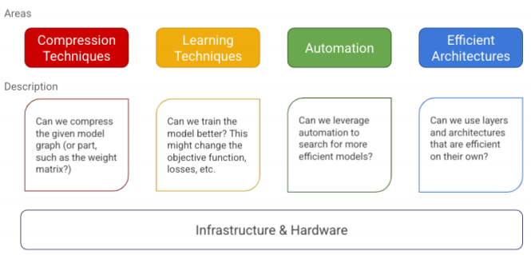

# PapersRead
Repo where I will be storing notes on papers read.

## Efficient Deep Learning: A Survey on Making Deep Learning Models Smaller, Faster, and Better (2021) [link](https://arxiv.org/abs/2106.08962)

A deep learning practitioner might face the following challenges when training or deploying a model:

- **Sustainable Server-Side Scaling**: Training and deploying large deep learning models is
costly. While training could be a one-time cost (or could be free if one is using a pre-trained
model), deploying and letting inference run for over a long period of time could still turn
out to be expensive in terms of consumption of server-side RAM, CPU, etc.. There is also
a very real concern around the carbon footprint of datacenters.
- **Enabling On-Device Deployment**: Certain deep learning applications need to run realtime
on IoT and smart devices. Enabling On-Device Deployment: Certain deep learning applications need to run realtime on IoT and smart devices.
- **Privacy & Data Sensitivity**: Being able to use as little data as possible for training is critical when the user-data might be sensitive.

The common theme around the above challenges is efficiency. We can break it down further as
follows: 
- **Inference Efficiency**
- **Training Efficiency**

Regardless of what one might be optimizing for, we want to achieve pareto-optimality. This
implies that any model that we choose is the best for the tradeoffs that we care about. Hence, when we seek efficiency, we should be thinking about discovering and improving on the pareto-frontier.

### Mental model
In this section we present the mental model to think about the collection of algorithms, techniques,and tools related to efficient deep learning. We propose to structure them in five major areas, with the first four focused on modeling, and the final one around infrastructure and tools.

### Landscape of Efficient Deep Learning
#### Compression Techniques
Compression techniques, are usually generic techniques for achieving a more efficient representation of one or more layers in a neural network, with a possible quality trade off. The efficiency goal could be to optimize the model for one or more of the footprint metrics in exchange for as little quality loss as possible. In some cases if the model is over-parameterized, these techniques can improve model generalization.

##### Pruning

